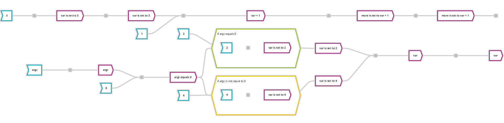

# HACKATHON IMPACT USA NYC 2017

<p align="center">
  
</p>

This document provides all necessary information (hopefully) to fulfill the 5
days hackathon organized by IMPACT USA in NYC starting from June the first 2017
and ending June the 7th.

We first want to thank all participants for their involvement in the **Deep
Algo** technology and we hope you'll enjoy this trip.

## Deep Algo

**Algorithm Visualization: We need oversight and transparency!**

### What is it useful for?

Today, we are already surrounded by sophisticated algorithms: smartphone apps,
connected objects, advertising personalization, product recommendations,
travel organization, etc.

More and more decisions become automated and processed by algorithms:
algorithms drive businesses, customers, your personal life...

At **Deep Algo**, we believe oversight and transparency of algorithms becomes a
necessity. We have to give end users more information about the algorithms
underlying the technologies on which they rely.

Our technology is able to extract algorithms automatically from a code-base but
we need help to make them accessible to everyone. Few people understand code,
it is a lot of data and there is no standard representation system for
algorithms.

### Who we are

Deep Algo is a Data Science Startup at the forefront of the Algorithmic
Transparency. We believe that in our data-obsessed world, nobody will tolerate
that opaque algorithms are left to take decisions: we need oversight and
transparency.

### What we do

Deep Algo is a SaaS solution for algorithm visualization.  Deep Algo is a
powerful tool to get a deep insight into your code. It helps you to document,
validate and ensure the transparency of algorithms.  Our solution is based on
our unique technology. We automatically extract algorithms from code and
represent them in a simple format: ICAO (Input, Condition, Action, Output).
In the end, Deep Algo opens the code Black Box that rules businesses to make
algorithms transparent and accountable.

## Objectives

### Challenge

We aim at open sourcing the data visualization part of our technology. We are
language theoretic, data mining or AI engineers, and we wish to make the
community benefits from our expertise by letting it providing brilliant ideas
on the front-end part.

Given a code-base, we produce a set of *Data Flow Graphs* representing the
evolution of variables (data) throughout the call-stack of all functions. This
yields a huge amount of graphs and each graph can potentially be composed of
many nodes and edges.

Our main challenge is to provide a front-end for navigating among these graphs
so that a "non-developer" can understand what the application does. By
non-developer we mean people that are tightly or loosely involved in an
application development process but have no developer background:

 * Business analysts
 * End users
 * Product managers
 * Team managers
 * ...

### What we expect from you

The objective of this hackathon is, for you, to propose a GUI to visualize,
navigate, interact, etc. with our data.

### Prerequisites

In order to enter this hackathon, you need to:

  * :computer: Know how to read code or on the opposite have no idea of what code is
  * :busts_in_silhouette: Have sense of user experience
  * :art: Have artistic flair
  * :doughnut: Know the [JSON](http://json.org/) format
  * :spider_web: Have some knowledge of graphs
  * :unicorn: Have a great imagination
  * :tada: Have a bit of sense of humor is always better
  * :heart: Love computer science


### How to win your hackathon?

The jury will elect the most comprehensive visualization. That is:

  * Understandable: those who can't read code must understand your UI.
    The jury won't have access to the code!
  * Simple: ease of use
  * Technically feasible

For the sake of fairness, all participants will present the result of their
work on the same set of data.

### Input

  * Given the time line, and for the sake of simplicity we have chosen a very
     simple `Java` application of a [Poker Texas Hold'em][poker] game.
  * For the sake of simplicity and ease of use, we have chosen to export our
    database in a `JSON` format that represents the *Data Flow Graphs* with
    all necessary information.

So in summary, you start with [these `JSON` files][poker_files] representing
the entire [Poker Texas Hold'em][poker] application.

### Expected outputs

What matters the most is your ideas! So you can provide any format that best
describes them: from a fully functional Web GUI to a deck of slides with static
images.

### You have questions

 * [Deep Algo slack](https://deepalgo.slack.com/shared_invite/MTg2NjI3NTgyMDE3LTE0OTU2MTMwMTctMjg5Yjc4NTEzOQ)
 * Open an issue on our [Deep Algo GitHub](https://github.com/DeepAlgo/HackathonJune2017/issues)

### Other resources

These are the [graphical resources](resources) we use at **Deep Algo**. Use
them if you like but please feel free to express your own creativity.

## Technical matters

From a technical point of view **Deep Algo** basically constructs a *Data Flow
Graph* out of a codebase. It follows the process below:

 1. Parse plain text code
 2. Generate a MongoDB representation based on our in-house *Unified Meta Model*
 3. Generate a *Control Flow Graph*
 4. Generate a *Data Flow Graph*

A sample code vs Data Flow Graph can be found [here](https://github.com/DeepAlgo/HackathonJune2017/tree/master/samples/main):

```c++
int main(int argc, char *argv[])
{
  int var=3;
  int more = var + 1;
  if(argc == 0){
    var = 2;
  }
  else{
    var = 4;
  }
  printf(more);
  return var;
}
```

Yielding the following **DFG** :

<p align="center">
  
</p>

You can [see this in your browser using GoJS][diagram] or
[another sample viewer using D3][diagram_d3]

[diagram]: https://deepalgo.github.io/HackathonJune2017/dfgviewer/index.html?main_5
[diagram_d3]: https://deepalgo.github.io/HackathonJune2017/d3viewer/index.html?main_5

### More information

 * Data-Flow Analysis:
   * [Wikipedia article](https://en.wikipedia.org/wiki/Data-flow_analysis)
   * mathematical background:
     * [The very first article](https://courses.cs.washington.edu/courses/cse501/15sp/papers/cousot.pdf)
     * [Course  inter-procedural analysis](http://www.seas.harvard.edu/courses/cs252/2011sp/slides/Lec05-Interprocedural.pdf)
     * [Fixpoint Theorem](https://projecteuclid.org/euclid.pjm/1103044538)
 * Graph visualization:
   * [GoJs](https://gojs.net/latest/index.html) is the library we use. It draws on a `canvas`
   * [D3](https://d3js.org/) uses the DOM
   * [graphviz](http://www.graphviz.org/): the famous `dot` command

### How to setup your environment?

 1. **Get a copy of this repository**:
    * [Clone it](https://help.github.com/articles/cloning-a-repository/) using `git`: `git clone https://github.com/DeepAlgo/HackathonJune2017.git`
    * Or download [a ZIP archive of this whole repository](https://github.com/DeepAlgo/HackathonJune2017/archive/master.zip)

 2. **Find the Poker dataset**:

    In your copy of the repository, navigate to [`samples/poker`](https://github.com/DeepAlgo/HackathonJune2017/tree/master/samples/poker/).
    Several files are available:

    * [`src/**/*.java`](https://github.com/DeepAlgo/HackathonJune2017/tree/master/samples/poker/src/org/ozsoft/texasholdem)
      are the Java source files of the Poker game that Deep Algo analyzed.

    * [`dfg/*.json`](https://github.com/DeepAlgo/HackathonJune2017/tree/master/samples/poker/dfg)
      are the generated Data Flow Graphs (DFG). The numbers in the
      file names have no special meaning; however, they uniquely identify a DFG
      in a the current dataset (Poker) and they are used to link DFGs together,
      using the field `calledGraphId` of the JSON format.

    To preview one of the DFGs (e.g. `45.json`) using our provided viewer:
     1. open [`dfgviewer/index.html`]
        in a recent web browser
     2. click in the text field at the top and select your sample with a click.
        You can type the number, the question (How to...) or the name of
        the code method to find the matching graph.

 3. **Find smaller samples**:

    We also provide more samples in the same format, so that you can test
    a few very simple examples:

    | Folder name        | Sample                                                 |
    | ------------------ | ------------------------------------------------------ |
    | `samples/main`     | The DFG of a simple `main()` function                  |
    | `samples/subgraph` | A simple call to a sub-algorithm, i.e. two linked DFGs |
    | `samples/loop`     | A DFG with a looping condition                         |

### Deep Algo Data Flow Graph

Let's dig into the real stuff now!

**Deep Algo** data flow graph is composed of:

 1. **Nodes**: represent three major class of information:
    * *Data*: a data node corresponds to the state of a variable in the
      program. Data nodes are split in 2 sub-classes:
      * *Input*: any variable in the program. When this variable is a *hard
        coded value* (such as a number or character string) we have sub-class
        for that:
        * *Value*: any literal value (e.g. the integer `42` or the string `"Bob"`)
      * *Output*: any variable in the program.
    * *Activity*: an activity node corresponds to an instruction that either
      reads or modifies a data. Activity nodes are split many sub classes:
      * *External function call*: a program may call functions defined in other
        libraries or resources.
      * *Internal function call*: these are instructions that call other
        functions defined in the application
    * *Condition*: a condition node corresponds to a one branch of a decision
      taken in the program. For example with an `if-else` structure, the
      *Condition* represents the action taken in the `if`, when the condition
      is true.
      * *ConditionAlt*: this special kind of condition represents the
        alternative path, in the case of an `if-else` it's the contents of
        the `else`.
      * *Loop*: loops are the specific condition that represent a repeated
        sequence of instructions, as long as the condition is verified.

 2. **Edges**: represent the flow between data, activities and conditions.
    * *In edges*: are edges that point to a node.
    * *Out edges*: are edges that point out from a node.

 3. **Groups**: are nodes embedding a sub graph. The set of group nodes are:
    * *Activity* nodes
    * *Condition* nodes, including *ConditionAlt* and *Loop* nodes

Following is a schematic view of nodes architecture:


### Deep Algo JSON scheme

See [the interactive documentation](https://deepalgo.github.io/HackathonJune2017/docson/index.html#../jsonscheme/ioca_json_schema.json)
(made with [docson](https://github.com/lbovet/docson))

### JSON Samples

#### Basic

[`basic.json`](https://github.com/DeepAlgo/HackathonJune2017/tree/master/samples/handwritten/dfg/basic.json)

<a href="https://deepalgo.github.io/HackathonJune2017/dfgviewer/index.html?handwritten_basic">
  
</a>

#### Sub Graph

The caller graph: [`caller.json`](https://github.com/DeepAlgo/HackathonJune2017/tree/master/samples/handwritten/dfg/caller.json)

<a href="https://deepalgo.github.io/HackathonJune2017/dfgviewer/index.html?handwritten_caller">
  
</a>

The called graph: [`callee.json`](https://github.com/DeepAlgo/HackathonJune2017/tree/master/samples/handwritten/dfg/callee.json)

<a href="https://deepalgo.github.io/HackathonJune2017/dfgviewer/index.html?handwritten_callee">
  
</a>

When assembled in the same view, those two graphs should look like that:

<a href="https://deepalgo.github.io/HackathonJune2017/dfgviewer/index.html?handwritten_callercallee">
  
</a>

#### The description is different from the text when multiple values can be found for one data

[`multival.json`](https://github.com/DeepAlgo/HackathonJune2017/tree/master/samples/handwritten/dfg/multival.json)

<a href="https://deepalgo.github.io/HackathonJune2017/dfgviewer/index.html?handwritten_multival">
  
</a>

[poker]: https://code.google.com/archive/p/texasholdem-java/
[poker_files]: ./samples/poker/dfg/
